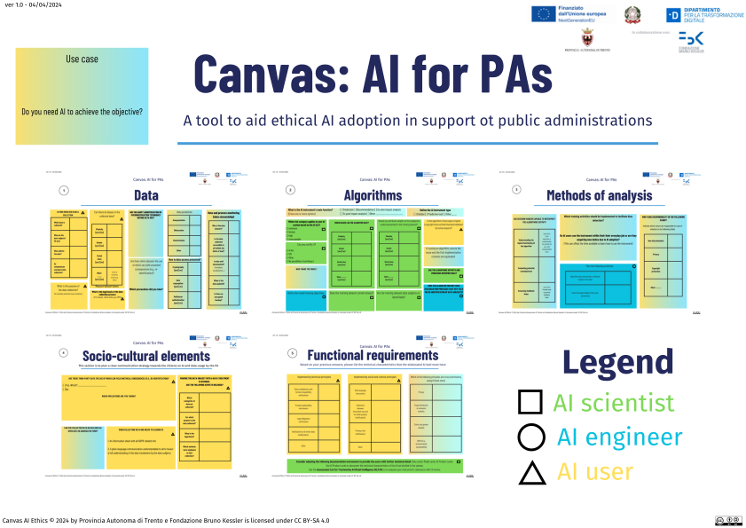

# canvas AI ethics
a canvas to plan the development of an AI solution

## description
[A canvas to design and deploy ethical artificial intelligence for public administrations. The experience of the Autonomous Province of Trento, Italy](https://papers.ssrn.com/sol3/papers.cfm?abstract_id=4819535)

This tool was developed as part of the [AIxPA[(https://sites.fbk.eu/aixpa-it/) – Flagship Project, focused on the digitalization of the public administration of the Autonomous Province of Trento. The project is funded by the National Complementary Plan to the NRRP, measure A.1.3.
CUP: C49G22001020001

## download pdf
### italian version
\
[download italian version](https://github.com/dclfbk/canvasaiethics/blob/main/pdf/it/canvas_ai_ethics_AIxPA.pdf)

### english version
\
[english version](https://github.com/dclfbk/canvasaiethics/blob/main/pdf/en/canvas_ai_ethics_AIxPA_en.pdf)

<!-- ### sources -->
<!-- https://www.canva.com/design/DAF-pihOVVo/P5MajTVQclYU3wk8PgA3RQ/edit -->

